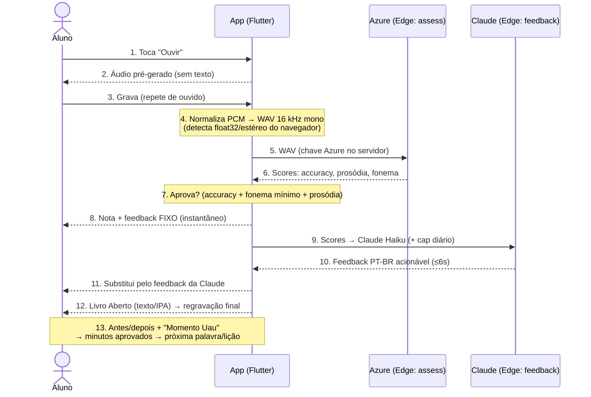

# Fluxo: do "ouvir" até o feedback (loop core de um item)

Sequência de uma palavra no loop som-first. Duas viagens de rede (Azure e
Claude), nenhuma chave no cliente. O feedback fixo aparece na hora; o da Claude
substitui quando chega (≤6s, com fallback pra fixa em qualquer falha).

Referências no código: [`lesson_screen.dart`](../lib/screens/lesson_screen.dart),
[`audio_recorder_service.dart`](../lib/services/audio_recorder_service.dart),
[`backend_assessor.dart`](../lib/services/backend_assessor.dart),
Edge Functions [`assess`](../supabase/functions/assess/index.ts) e
[`feedback`](../supabase/functions/feedback/index.ts),
critério em [`lesson.dart`](../lib/models/lesson.dart).

## Passos que mais importam
- **Som-first:** a escrita (passo 12, Livro Aberto) só aparece **depois** da 1ª
  tentativa oral.
- **Normalização (4):** o navegador ignora o formato pedido e entrega float32 na
  taxa nativa (ex.: 44,1 kHz), às vezes estéreo; o app detecta e reamostra pra
  16 kHz mono — o que o Azure exige.
- **Corte de custo:** gravação só-silêncio retorna null e **não** chama o Azure.
- **Aprovação (7):** não usa PronScore (infla e não separa sotaque); usa
  accuracy + piso por fonema + prosódia (nas lições de ritmo).
- **Feedback resiliente:** fixo na hora, Claude quando chega; o app nunca
  depende da Claude pra funcionar.
